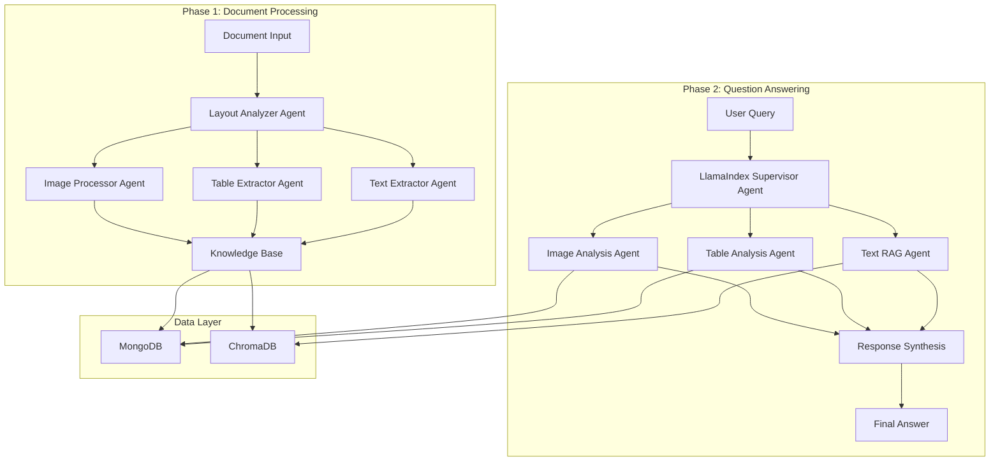

# 🏗️ System Architecture

## Overview

The Advanced Agentic Document Intelligence System implements a sophisticated multi-agent architecture designed for scalable document processing and intelligent question-answering. The system follows a modular, event-driven design that separates concerns across specialized agents.

## High-Level Architecture



## Design Principles

### 1. Agent-Based Architecture
- **Modularity**: Each agent has a specific, well-defined responsibility
- **Autonomy**: Agents operate independently with minimal coupling
- **Composability**: Agents can be combined in different workflows
- **Extensibility**: New agents can be added without modifying existing ones

### 2. Multi-Provider LLM Support
- **Provider Abstraction**: Unified interface for Cerebras and Groq
- **Dynamic Configuration**: Runtime provider switching via environment variables
- **Consistent Model Tracking**: Single `LLM_MODEL` field for all providers

### 3. Fault Tolerance
- **Graceful Degradation**: System continues to operate even if some agents fail
- **Error Isolation**: Agent failures don't cascade to other components
- **Fallback Strategies**: Alternative processing methods when primary methods fail

## Detailed Component Architecture

### Phase 1: Document Processing Pipeline

#### 1. Layout Analyzer Agent
**Purpose**: Analyze document structure and identify content regions

**Technology Stack**:
- LayoutParser with PubLayNet model (optional)
- PyMuPDF for PDF structure analysis
- Fallback to basic layout detection

**Process Flow**:
1. Load document (PDF/DOCX)
2. Attempt advanced layout detection (if available)
3. Fallback to basic structure analysis
4. Identify content blocks (text, tables, images, headers)
5. Extract bounding boxes and metadata

#### 2. Text Extractor Agent
**Purpose**: Extract textual content while preserving formatting

**Technology Stack**:
- PyMuPDF for PDF text extraction
- python-docx for Word documents
- Font and formatting preservation

**Process Flow**:
1. Extract text from identified regions
2. Preserve reading order and formatting
3. Handle headers, paragraphs, and lists
4. Generate structured text elements

#### 3. Table Extractor Agent
**Purpose**: Extract and structure tabular data

**Technology Stack**:
- Multiple extraction methods (Camelot, Tabula, layout-guided)
- pandas for data manipulation
- Validation and cleaning algorithms

**Process Flow**:
1. Use multiple extraction methods in parallel
2. Layout-guided extraction using bounding boxes
3. Validate and clean extracted data
4. Convert to structured format

#### 4. Image Processor Agent
**Purpose**: Extract images and associated metadata

**Technology Stack**:
- PyMuPDF for PDF image extraction
- PIL for image processing
- Base64 encoding for storage

**Process Flow**:
1. Extract embedded images
2. Generate metadata and descriptions
3. Save images and create references
4. Associate with layout information

### Phase 2: Question Answering System

#### 1. LlamaIndex Supervisor Agent
**Purpose**: Orchestrate query processing using ReAct framework

**Technology Stack**:
- LlamaIndex ReAct Agent framework
- Multi-provider LLM support (Cerebras/Groq)
- Custom tool creation and management

**Process Flow**:
1. Analyze query intent and requirements
2. Select appropriate tools/agents
3. Execute reasoning steps
4. Synthesize final answer with sources

#### 2. Text RAG Agent
**Purpose**: Answer questions using retrieval-augmented generation

**Technology Stack**:
- ChromaDB for vector similarity search
- Sentence Transformers for embeddings
- Intelligent chunking and ranking

**Process Flow**:
1. Generate query embedding
2. Search for similar text chunks
3. Rank and filter results
4. Generate context-aware answer

#### 3. Table Analysis Agent
**Purpose**: Query and analyze tabular data

**Technology Stack**:
- Direct embedding content processing
- MongoDB for table metadata
- Natural language to data query translation

**Process Flow**:
1. Search relevant table content in embeddings
2. Process table data directly from vector store
3. Generate structured responses
4. Include table references and citations

#### 4. Image Analysis Agent
**Purpose**: Answer questions about images and figures

**Technology Stack**:
- Caption and metadata analysis
- Fallback to database search
- Figure reference resolution

**Process Flow**:
1. Search for relevant images by query
2. Fallback to all available images if needed
3. Analyze metadata and context
4. Generate descriptions with references

## Data Architecture

### Database Schema Design

#### MongoDB Collections

**Documents Collection**:
```javascript
{
  document_id: "unique_timestamp_id",
  metadata: {
    filename: "string",
    file_path: "string", 
    file_size: "number",
    file_type: "string",
    page_count: "number"
  },
  elements: ["array_of_element_ids"],
  processing_status: "pending|processing|completed|failed",
  created_at: "timestamp",
  updated_at: "timestamp"
}
```

**Elements Collection**:
```javascript
{
  element_id: "unique_timestamp_id",
  document_id: "parent_document_id",
  content_type: "text|table|image|header|footer|list",
  text_content: {
    content: "string",
    font_size: "float",
    is_bold: "boolean"
  },
  table_content: {
    headers: ["array"],
    rows: [["array_of_arrays"]],
    caption: "string"
  },
  image_content: {
    image_path: "string",
    caption: "string",
    description: "string"
  },
  created_at: "timestamp"
}
```

**Clean Response Structure**:
```javascript
{
  query_id: "string",
  answer: "string",
  intent: "text_search|table_query|image_query|multi_modal",
  sources: [{
    document_id: "actual_db_document_id",
    document_name: "filename",
    page_count: "number"
  }],
  detailed_sources: [{
    element_id: "chunk_id",
    document_id: "actual_db_document_id",
    content_type: "text|table|image",
    page_number: "number"
  }],
  model_used: "from_LLM_MODEL_env_var"
}
```

#### Vector Database (ChromaDB)
- Collection: `document_embeddings`
- Embedding Model: `all-MiniLM-L6-v2` (384 dimensions)
- Distance Metric: Cosine similarity
- Metadata: document_id, content_type, element_id

## Configuration Management

### Unified Model Configuration
```python
class Settings(BaseSettings):
    # Provider Selection
    llm_provider: str = "groq"  # "cerebras" or "groq"
    
    # Generic Model Configuration
    llm_model: str = "llama-3.1-8b-instant"  # Works for both providers
    
    # API Keys
    cerebras_api_key: Optional[str] = None
    groq_api_key: Optional[str] = None
    
    # Performance
    llm_temperature: float = 0.1
    llm_max_tokens: Optional[int] = None
```

### Environment Variables
```bash
# Provider Configuration
LLM_PROVIDER=groq  # or cerebras
LLM_MODEL=llama-3.1-8b-instant  # model for selected provider

# API Keys
GROQ_API_KEY=your_groq_key
CEREBRAS_API_KEY=your_cerebras_key
```

## Agent Communication Protocol

### Base Agent Interface
```python
class BaseAgent(ABC):
    @abstractmethod
    async def process(self, input_data: Any, **kwargs) -> AgentResponse
    
    def create_response(
        self,
        content: Any,
        response_type: str,
        sources: List[str] = None,
        metadata: Dict[str, Any] = None,
        processing_time: Optional[float] = None
    ) -> AgentResponse
```

### Response Format
```python
class AgentResponse(BaseModel):
    agent_name: str
    response_type: str
    content: Union[str, Dict[str, Any], List[Any]]
    sources: List[str] = Field(default_factory=list)
    metadata: Dict[str, Any] = Field(default_factory=dict)
    processing_time: Optional[float] = None
```

## LLM Provider Integration

### Provider Factory Pattern
```python
class LLMFactory:
    @staticmethod
    def create_llm(settings: Settings) -> LLM:
        if settings.llm_provider == "groq":
            return Groq(model=settings.llm_model, ...)
        elif settings.llm_provider == "cerebras":
            return LangChainLLM(llm=ChatCerebras(model=settings.llm_model, ...))
    
    @staticmethod
    def create_langchain_llm(settings: Settings) -> Union[ChatGroq, ChatCerebras]:
        # LangChain-compatible LLMs for specific agents
```

## Scalability Considerations

### Horizontal Scaling
- **Stateless Design**: All agents are stateless for parallel processing
- **Provider Load Balancing**: Multiple API keys for rate limit distribution
- **Database Optimization**: Proper indexing and connection pooling

### Performance Optimization
- **Vector Search**: Optimized ChromaDB indexes
- **Caching**: LLM response and embedding caching
- **Async Processing**: Non-blocking operations throughout

## Security Architecture

### Configuration Security
- Environment variable management
- API key protection
- Input validation and sanitization

### Data Protection
- Document data isolation
- Secure database connections
- Configurable data retention

## Testing and Validation Architecture

### Test Structure Design

**Two-Tier Testing Approach**:
- **Configuration Tests**: Validate environment, dependencies, and setup
- **System Tests**: Validate actual functionality with intelligent mocking

### Test Categories

**Configuration Validation (`test_config.py`)**:
```python
TestEnvironmentConfiguration     # Settings and environment variables
TestAPIKeyConfiguration         # Provider setup and validation
TestDatabaseConfiguration      # MongoDB and ChromaDB connections
TestModelConfiguration        # LLM and embedding model setup
TestSystemDependencies       # Import validation and dependencies
TestLoggingConfiguration     # Logging setup and functionality
```

**System Functionality (`test_system.py`)**:
```python
TestAgentInitialization       # Agent creation and basic functionality
TestDocumentProcessing       # Orchestrator and processing pipeline
TestDatabaseOperations      # Database interactions and data flow
TestQuestionAnswering      # QA agents and supervisor routing
TestEndToEndWorkflow      # Complete document-to-QA workflows
TestSystemPerformance    # Memory usage and concurrent operations
```

### Test Environment Management

**Intelligent Skipping Strategy**:
- Tests automatically skip when dependencies unavailable
- API key detection for provider-specific tests
- Database availability detection for storage tests
- Graceful degradation in CI/CD environments

**Mocking Strategy**:
- Database operations mocked for unit tests
- LLM responses mocked for deterministic testing
- File system operations use temporary directories
- Network calls isolated from external dependencies

### Continuous Validation

**Multi-Level Validation**:
1. **Import Level**: Module and class imports
2. **Configuration Level**: Settings and environment validation
3. **Unit Level**: Individual component testing
4. **Integration Level**: Cross-component workflows
5. **System Level**: End-to-end functionality

**Test Markers for Selective Execution**:
- `requires_api_key`: Tests requiring real LLM providers
- `requires_mongodb`: Tests requiring database connections
- `integration`: Full system integration tests
- `slow`: Performance and long-running tests

## Monitoring and Observability

### Logging Strategy
- Structured logging with agent metadata
- Performance metrics tracking
- Error reporting and debugging
- Test execution logging and validation

### Health Checks
- Database connectivity monitoring
- Agent availability verification
- Model performance tracking
- Configuration validation endpoints

### Quality Assurance

**Code Quality Gates**:
- Type annotation coverage
- Documentation completeness
- Error handling robustness
- Performance benchmarking

**Automated Validation**:
- Configuration validation on startup
- Health check endpoints for monitoring
- Automated test execution in CI/CD
- Performance regression detection

This architecture provides a robust foundation for scalable, maintainable document intelligence systems with modern LLM provider support, comprehensive testing, and clean separation of concerns.